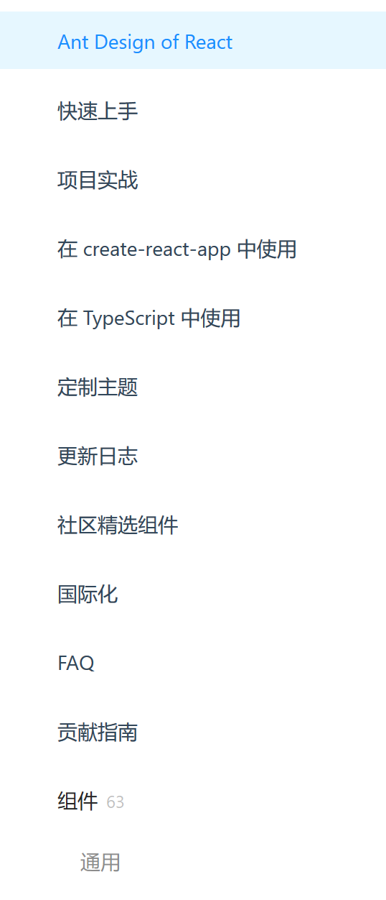

# className 的命名规则：

- 组件外壳：`组件名称[--所属阵营] [状态]`
- 组件的子部分：`成分名称 状态`

## 例子（Toc 组件）

`
` ----- 组件外壳
`
` ----- 子组件位
`
`----- 子组件位(含状态)

## 所属阵营（一个组件最多从属 2 个阵营）

1. `nav` （h 会引起路由改变的东西）（举例：Toc、Breadrumb）
2. `form` (各种交互控件)（举例：Switch、Radio、Checkbox、NumberSlider）
3. `data` (用于数据展示)
4. `popup`（给予用户反馈，只有当满足交互条件时才会出现的组件）
5. `----`（无阵营组件）（流窜于各种大组件的寄生性小组件，无法也不能独立存活）（举例：IconItem）
6. `widget`（独立于阵营，混沌属性）(示例： `
`)
7.~~`layout` (格式与因业务需求临时取的 className 相同，其实就只是个排版的语义型 DIV)（非叶组件，更多地是一些 class 命名习惯）~~

## 组件收集

- 组件以`_`开头，以区分其他 className，并利用 vscode 的内置 autoimport，以增快开发速度。
- 所有子组件均可由其他组件代替，注意，替换行为必定伴随嵌套。
- 所有子组件也提供一个默认设置，这是类似于 JS 高阶函数中的回调一般的存在。
- 子组件位都只是盒子
- 子组件、样式 class 在 css 中以 lower-case 出现，js 中以 PascalCase 出现
- 所有子组件位既接收 `()=><Component title="hello" />` 也接收 `<Component title="hello" />`

### 暂记（写完了要删除）

- 像 tabbar、menu 等的指示形线条属于组件的样式属性，用 css 控制（需要给个专门的 class）
- TODO： 一项提案：layout 布局组件都有`antd <Container>`一般的规定嵌套的行为
- TOFIX: 内容足够多时，想想 Markdown 格式排版问题
- ~~组件后置下划线的语义、区分作用，都比前置下划线明确~~
- ~~干脆不要下滑线了，只由大写与否区分组件 class.component 级组件均要有 date-component=true~~
- 组件的 calss 只由大小写加以区分，且组件的根 DIV 均要有 data-component=true
- 子组件位的 class 与样式 class 相同（css 中为 camelCase）。（除第一层组件外，能容纳组件的一定是子组件位）
- 属性组件Group的特点：Group上监听click事件，内部元素上没有监听事件。

### Menu

- 组件阵营：`nav`
- 子组件位：
  - Item
  - ItemGroup
- 样式 class：activeIndicator
  

### Toc

- 组件阵营：`nav`
- 子组件位：
  - Item
- 样式 class：activeIndicator
  

### Tab

- 组件阵营：`nav`
- 子组件位
  - Tablist
  - TabPanel: 承载各个 tab 的内容物，此子组件位在视觉层次上为必选项
- 样式 class：activeIndicator
  

### Logo

- 描述：一般处于 Topbar 的左侧
- 组件阵营：`nav`
  

### Switch

- 组件阵营：`form`
- props:
  - `label`: 可点击的区域

### Radio

- 组件阵营：`form`
- props:
  - `label`: 可点击的区域

### Checkbox

- 组件阵营：`form`
- props:
  - `label`: 可点击的区域

### Slider（用于 NumberInput）

- 组件阵营：`form`
- props
  - max
  - min
  - step

### Text

- 组件阵营：`data`
- props:
  - tag: 选择文字包裹在什么标签里，默认 `'span'`
  - children: 内容文字

### Button

- 组件阵营：`data`
- 子组件位：
  - GroupContainer: 用于包裹他们使他们形成一个组

### Details

- 组件阵营：`data`
- props:
  - open: 是否打开状态
- 子组件位：
  - props.children：相当于`
`的`<summery>`
  - Dropdown: 打开状态下显示的内容

### NumberInput

- 组件阵营：`widget`(Slider + Button + Tooltip + Text)
- 描述：数字输入框，数字滑块是一个名为“Slider”的 内置 组件
- props:
  - hasSlider: 是否有一个辅助型组件“Slider"（默认有 tooltip，当 hasNumberPanel 也开启时没有 tooltip）
  - SliderProps: （同 Slider 的 props 内容）
  - hasText：是否显示数字
  - Text: (同 Text 的 props 内容)

## 惯用 class 命名：

| class            | 作用                         | 截图                                                                                             |
| ---------------- | ---------------------------- | ------------------------------------------------------------------------------------------------ |
| `site-bar`       | 网站顶部导航栏               |                                                                  |
| `side-bar`       | 侧边栏                       |   |
| `artical-header` | 包含文章标题以及对标题的操作 |                                                         |
| `artical-title`  | 文章标题                     |                                                                                                  |
| `artical-action` | 对标题的操作                 |                                                                                                  |
